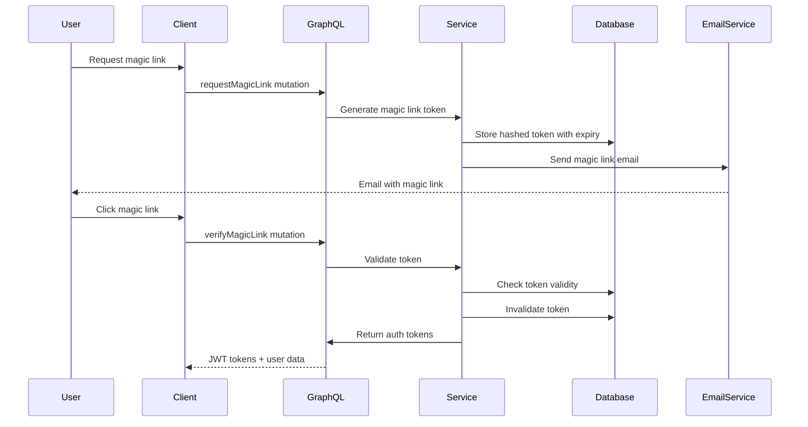
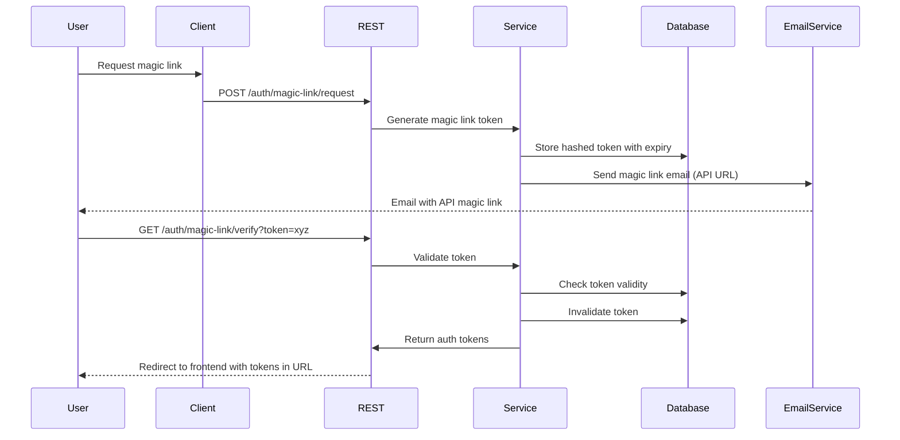
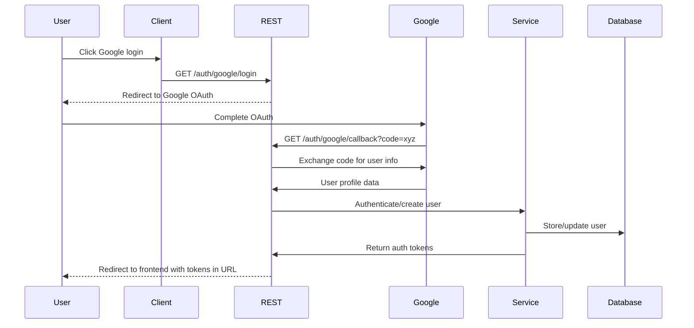

# Magic Link Login Design Document

## Overview

The magic link login feature will provide passwordless authentication by sending users a secure, time-limited link via email. This feature integrates seamlessly with the existing authentication system, maintaining compatibility with email/password and Google OAuth methods while following established patterns for token management and email delivery.

## Architecture

### High-Level Flow - GraphQL Mode (Existing)



### High-Level Flow - REST Mode (New)



### High-Level Flow - Google OAuth REST Mode (New)



### Integration Points

- **Database Layer**: New MagicLinkToken model following existing token patterns (OTP, PasswordResetToken)
- **Service Layer**: New MagicLinkService integrated with existing UserService and GoogleAuthService
- **GraphQL Layer**: New mutations and resolvers following existing authentication patterns
- **REST Layer**: New REST endpoints that leverage existing services and produce same JWT tokens
- **Email System**: Leverages existing EmailService infrastructure with configurable URL generation
- **Authentication Flow**: Produces same JWT tokens as existing login methods across all endpoints
- **Configuration**: Environment-based configuration for choosing REST vs GraphQL flows

## Components and Interfaces

### 1. Database Model - MagicLinkToken

**File**: `src/models/magicLinkToken.model.ts`

```typescript
interface MagicLinkTokenDocument {
  email: string;
  tokenHash: string; // Hashed version of the token
  expires: Date;
  used: boolean;
  createdAt: Date;
}
```

**Key Features**:

- Follows existing token model patterns (similar to PasswordResetToken)
- Stores hashed tokens for security
- Automatic cleanup via TTL index
- Pre-save middleware for email sending
- Automatic invalidation of existing tokens

### 2. Service Layer - MagicLinkService

**File**: `src/services/magicLink.services.ts`

```typescript
interface MagicLinkService {
  requestMagicLink(
    email: string
  ): Promise<{ success: boolean; message: string }>;
  verifyMagicLink(token: string): Promise<{
    accessToken: string;
    refreshToken: string;
    user: UserDocument;
  }>;
  cleanupExpiredTokens(): Promise<void>;
}
```

**Key Features**:

- Rate limiting (3 requests per 15 minutes per email)
- Cryptographically secure token generation
- Constant-time token comparison
- Integration with existing UserService for authentication
- Security logging for audit trails

### 3. GraphQL Layer

**Type Definitions** (`src/graphql/typeDefs/magicLink.ts`):

```graphql
type MagicLinkResponse {
  success: Boolean!
  message: String!
}

type Mutation {
  requestMagicLink(email: String!): MagicLinkResponse!
  verifyMagicLink(token: String!): AuthResponse!
}
```

**Resolvers** (`src/graphql/resolvers/magicLink.resolvers.ts`):

- `requestMagicLink`: Handles magic link generation and email sending
- `verifyMagicLink`: Handles token validation and user authentication

### 4. REST Layer (New)

**REST Endpoints** (`src/routes/auth.routes.ts`):

```typescript
// Magic Link endpoints
POST / auth / magic - link / request;
GET / auth / magic - link / verify;

// Google OAuth endpoints
GET / auth / google / login;
GET / auth / google / callback;
```

**REST Controllers** (`src/controllers/auth.controller.ts`):

```typescript
interface AuthController {
  // Magic Link REST methods
  requestMagicLinkRest(req: Request, res: Response): Promise<void>;
  verifyMagicLinkRest(req: Request, res: Response): Promise<void>;

  // Google OAuth REST methods
  initiateGoogleOAuth(req: Request, res: Response): Promise<void>;
  handleGoogleCallback(req: Request, res: Response): Promise<void>;
}
```

**Key Features**:

- Reuses existing service layer logic
- Handles redirects with tokens as URL parameters
- Configurable frontend and error redirect URLs
- Same security measures as GraphQL endpoints

### 5. Email Templates

**Magic Link Email Template**:

- Professional design using existing EmailService templates
- Clear call-to-action button
- Security messaging about link expiration
- Consistent branding with existing email templates
- **Configurable URL Generation**: Links point to either frontend (GraphQL mode) or API (REST mode)

### 6. Configuration System

**Environment Variables**:

```typescript
// Authentication flow configuration
AUTH_MODE: "graphql" | "rest" | "hybrid"; // Default: 'graphql'

// REST mode redirect URLs
FRONTEND_SUCCESS_URL: string; // Where to redirect after successful auth
FRONTEND_ERROR_URL: string; // Where to redirect after failed auth

// Optional user data in redirect
INCLUDE_USER_DATA_IN_REDIRECT: boolean; // Default: false

// Google OAuth configuration (existing + new)
GOOGLE_OAUTH_REDIRECT_URI: string; // For REST mode callbacks
```

**Configuration Service** (`src/config/auth.config.ts`):

```typescript
interface AuthConfig {
  mode: "graphql" | "rest" | "hybrid";
  frontendSuccessUrl: string;
  frontendErrorUrl: string;
  includeUserDataInRedirect: boolean;
  generateMagicLinkUrl(token: string): string;
  generateGoogleOAuthUrl(): string;
}
```

## Data Models

### MagicLinkToken Schema

```typescript
{
  email: {
    type: String,
    required: true,
    index: true
  },
  tokenHash: {
    type: String,
    required: true,
    unique: true
  },
  expires: {
    type: Date,
    required: true,
    default: () => new Date(Date.now() + 15 * 60 * 1000) // 15 minutes
  },
  used: {
    type: Boolean,
    default: false
  },
  createdAt: {
    type: Date,
    default: Date.now,
    expires: 900 // TTL index - 15 minutes
  }
}
```

### Rate Limiting Storage

- Utilize existing patterns or implement simple in-memory rate limiting
- Track requests per email address with sliding window
- Reset counters every 15 minutes

## Error Handling

### Client-Facing Errors

- **Invalid Email**: "Please provide a valid email address"
- **Rate Limited**: "Too many requests. Please try again in X minutes"
- **Invalid/Expired Token**: "This magic link has expired or is invalid"
- **User Not Found**: Generic success message (security consideration)

### Internal Error Handling

- Follow existing ErrorHandler patterns
- Log security events (failed attempts, rate limiting)
- Graceful degradation if email service fails
- Database connection error handling

### Security Considerations

- Never reveal whether an email exists in the system
- Use constant-time comparison for token validation
- Implement proper rate limiting to prevent abuse
- Hash tokens before database storage
- Automatic token cleanup and invalidation

## Testing Strategy

### Unit Tests (Optional)

- Token generation and validation logic
- Rate limiting functionality
- Email template generation
- Error handling scenarios

### Integration Tests (Optional)

- End-to-end magic link flow
- GraphQL mutation testing
- Database operations
- Email service integration

### Security Tests (Optional)

- Rate limiting enforcement
- Token timing attack prevention
- Expired token handling
- Invalid token scenarios

## Implementation Considerations

### Security Best Practices

1. **Token Generation**: Use `crypto.randomBytes()` for cryptographically secure tokens
2. **Token Storage**: Hash tokens using bcrypt before database storage
3. **Token Validation**: Implement constant-time comparison to prevent timing attacks
4. **Rate Limiting**: Implement sliding window rate limiting per email address
5. **Audit Logging**: Log all authentication attempts for security monitoring
6. **URL Parameter Security**: Sanitize and validate redirect URLs to prevent open redirect attacks
7. **Token Exposure**: Consider token exposure in URL parameters and implement short-lived tokens

### Performance Considerations

1. **Database Indexing**: Index on email and tokenHash fields
2. **TTL Cleanup**: Use MongoDB TTL indexes for automatic token cleanup
3. **Rate Limiting**: Use efficient in-memory storage for rate limit counters
4. **Email Queuing**: Leverage existing email service patterns for reliability
5. **Redirect Performance**: Minimize redirect chain length for better user experience

### Scalability Considerations

1. **Stateless Design**: No server-side session storage required
2. **Database Sharding**: Token model supports horizontal scaling
3. **Email Service**: Existing EmailService already handles multiple providers
4. **Caching**: Rate limiting data can be cached for performance
5. **Load Balancing**: REST endpoints are stateless and support horizontal scaling

### Monitoring and Observability

1. **Success Metrics**: Track magic link request and verification rates across both GraphQL and REST
2. **Security Metrics**: Monitor failed attempts and rate limiting events
3. **Performance Metrics**: Email delivery times, database query performance, and redirect latency
4. **Error Tracking**: Comprehensive error logging and alerting for both authentication flows
5. **User Experience Metrics**: Track authentication completion rates by flow type

### REST-Specific Considerations

1. **Error Handling**: Graceful redirect-based error handling instead of JSON responses
2. **State Management**: Handle OAuth state parameter for CSRF protection
3. **URL Length Limits**: Consider browser URL length limits when including user data
4. **SEO Impact**: Ensure authentication URLs are properly excluded from search indexing

## Migration Strategy

### Database Changes

- Create new MagicLinkToken collection
- Add appropriate indexes
- No changes required to existing User model

### API Changes

- Add new GraphQL mutations (non-breaking)
- Maintain backward compatibility with existing auth methods
- Update API documentation

### Deployment Strategy

- Feature can be deployed incrementally
- No downtime required for existing functionality
- Email templates can be tested in staging environment
